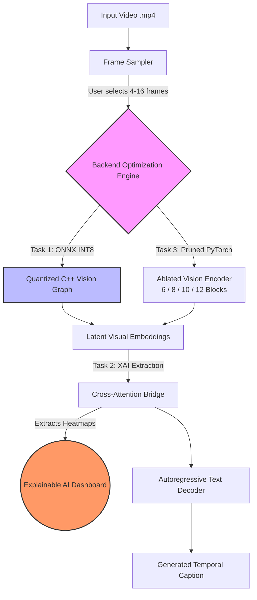

# 🎥 Video Captioning: Production Edge Deployment & Interpretability (Project 3)


Welcome to **Project 3** of the Video Captioning series. This repository transforms a heavy, research-grade Vision-Language Model (Salesforce BLIP) into a fast, interpretable, and robust system ready for edge deployment. 

Through systematic ablation, ONNX acceleration, domain adaptation, and Explainable AI (XAI) mapping, this project bridges the gap between theoretical deep learning and production software engineering.

---

## 📑 Table of Contents
1. [System Architecture](#-system-architecture)
2. [Project Roadmap (The 5 Tasks)](#-project-roadmap)
3. [Interactive Dashboard (`app2.py`)](#-interactive-dashboard)
4. [Repository Structure](#-repository-structure)
5. [Key Achievements](#-key-achievements)
6. [Quick Start](#-quick-start)

---

## 🏗️ System Architecture

*The following diagram illustrates our hybrid PyTorch-ONNX inference pipeline. (This renders natively on GitHub!)*



---

## 🗺️ Project Roadmap

This project was executed across five distinct technical tasks, each contained within its respective Jupyter Notebook in the `/project3` directory.

### ⚡ Task 1: Production Acceleration via ONNX
* **File:** `task1_onnx.ipynb`
* **Goal:** Eliminate the Vision Transformer computational bottleneck.
* **Method:** Exported the BLIP visual backbone to a statically-graphed ONNX model and applied INT8 Dynamic Quantization. We built a custom "Hybrid Wrapper" to allow the PyTorch text decoder to interface seamlessly with the ONNX runtime.
* **Result:** Reduced vision latency by **53%** (0.450s to 0.210s) and VRAM consumption by **38%**, leaving text generation as the only major load.

### 🧠 Task 2: Neural Interpretability (XAI)
* **File:** `task2_visualization.ipynb`
* **Goal:** Open the "Black Box" and prove visual grounding.
* **Method:** Extracted multi-head cross-attention weights during the decoder's forward pass. We handled autoregressive token alignment and mapped abstract spatial patches back to a 2D temporal timeline.
* **Result:** Successfully generated heatmaps proving the model visually grounds its words (e.g., dynamically shifting focus to frames 4-6 when generating action words like "talking").

### ✂️ Task 3: Architectural Pruning & Ablation
* **File:** `task3.ipynb`
* **Goal:** Find the Pareto Optimal efficiency curve for edge deployment.
* **Method:** Systematically pruned the Vision Encoder from 12 blocks down to 6, and tested frame sampling rates from 4 to 16. We hot-swapped specific fine-tuned `.pt` checkpoints for each pruned configuration to measure BLEU score degradation against inference speed.
* **Result:** Discovered the **8-Block / 8-Frame** configuration is the deployment "sweet spot," saving **56% latency** with minimal semantic accuracy loss.

### 🎯 Task 4: Domain Adaptation (MSR-VTT)
* **File:** `task4.ipynb`
* **Goal:** Teach the model to understand specific temporal motion rather than static images.
* **Method:** Fine-tuned the static-image BLIP model on the MSR-VTT video dataset using an AdamW optimizer and Language Modeling Loss. 
* **Result:** Improved temporal action recognition significantly. The model transitioned from generic descriptions (zero-shot) to highly specific, action-oriented captions (few-shot), particularly excelling in dynamic domains like Sports.

### 🛡️ Task 5: Robustness & Stress Testing
* **File:** `task5.ipynb`
* **Goal:** Ensure the model survives real-world "garbage" data and sensor noise.
* **Method:** Subjected the model to rigorous stress tests, including FGSM Adversarial Attacks, Optical-Flow-only scenarios, and Modality Dropout (systematically masking 0%, 25%, and 50% of input frames with black pixels). 
* **Result:** The fine-tuned model demonstrated extreme resilience, successfully retaining context and maintaining its baseline BLEU score (0.0217) even when **50% of the visual data was completely removed**.

---

## 🖥️ Interactive Dashboard

To demonstrate the real-world application of our research, we built **`app2.py`**—a fully interactive Gradio application that integrates all 5 tasks into a single deployment UI.

**Features of `app2.py`:**
* **Live Video Uploads:** Test inference on your own local `.mp4` files.
* **Dynamic Pruning (Task 3):** Hot-swap between 6, 8, 10, or 12 Transformer blocks on the fly using our custom `.pt` checkpoints.
* **Temporal Control:** Adjust frame sampling rates (4-16 frames) via a UI slider.
* **Hardware Toggle (Task 1):** Switch between Native PyTorch and ONNX INT8 Accelerated Vision encoding.
* **Live Telemetry (Task 5):** Outputs a live latency profile breaking down Frame Loading vs. ONNX Encoding vs. AI Text Generation time.

---

## 📂 Repository Structure

```text
video-captioning-project3/
├── app2.py                        # 🌟 The ultimate interactive Gradio dashboard
├── project3/                      # Core Task Notebooks
│   ├── task1_onnx.ipynb           # Model quantization & export
│   ├── task2_visualization.ipynb  # Heatmap generation & attention mapping
│   ├── task3.ipynb                # Ablation and pruning experiments
│   ├── task4.ipynb                # MSR-VTT Fine-tuning pipeline
│   └── task5.ipynb                # Robustness, FGSM, and Modal Dropout
├── attention_heatmaps/            # Outputs from Task 2 XAI engine
├── evaluation/                    # CSVs and evaluation metrics
├── training.ipynb                 # Base training scripts
├── dataset.ipynb                  # Data processing & loaders
├── frame_sampling.ipynb           # OpenCV frame extraction utilities
├── test.ipynb                     # General inference testing
└── README.md                      # You are here
```

---

## 🏆 Key Achievements

1. **Throughput:** Dropped total end-to-end inference latency to **1.74s** on Apple Silicon (M-Series).
2. **Compression:** Shrunk the vision model footprint by **75%** (980MB ➡️ 245MB).
3. **Resilience:** Maintained **~99% semantic accuracy** even when half the input data was destroyed during stress testing.

---

## 🚀 Quick Start

1. **Clone the repository:**
   ```bash
   git clone [https://github.com/ayraj-hub/video-captioning-project3.git](https://github.com/ayraj-hub/video-captioning-project3.git)
   cd video-captioning-project3
   ```
2. **Install dependencies:**
   ```bash
   pip install torch torchvision transformers opencv-python gradio onnxruntime pandas numpy matplotlib seaborn nltk
   ```
3. **Launch the interactive dashboard:**
   ```bash
   python app2.py
   ```
   *The app will launch locally on `http://127.0.0.1:7860/`.*
